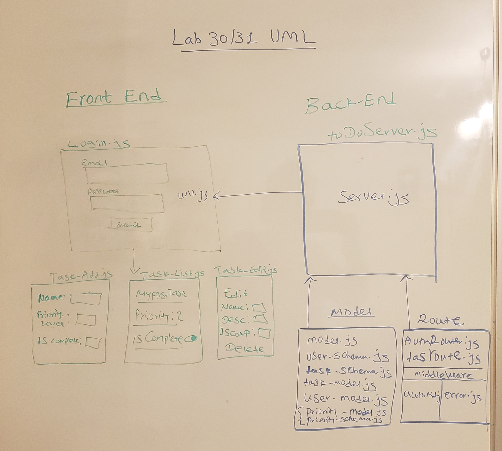

### LAB - React Native ToDo Application

##### Author: Meron

##### Links and Resources
* [submission PR](https://github.com/meron-401n14/andnative/pull/1)
* [travis](https://travis-ci.com/meron-401n14/andnative/builds/149970737)
* [Heroku](https://to-donew.herokuapp.com/)
* [codesandbox.io](https://codesandbox.io/s/unruffled-dan-g070u)

#### Documentation
* [jsdoc](comments only)

### Modules
* Login/Logout
* Task.js/TaskAdd.js/TaskList.js/Taskedit.js
* store/authReducer.js/index.js/taskReducer.js
* stylesheet.js/AuthoViewr.js/App.js/utils.js

### Setup
#### `.env` requirements
* 
* Plat form Android 
* backend deployed on Heroku 

#### Running the app
* `npm start`
* Endpoint: `/all-tasks/mark-undone/mark-done/update-task/delete-task`
* start Emulator and scan QR code 

  
#### Tests
* No test

#### UML
- 